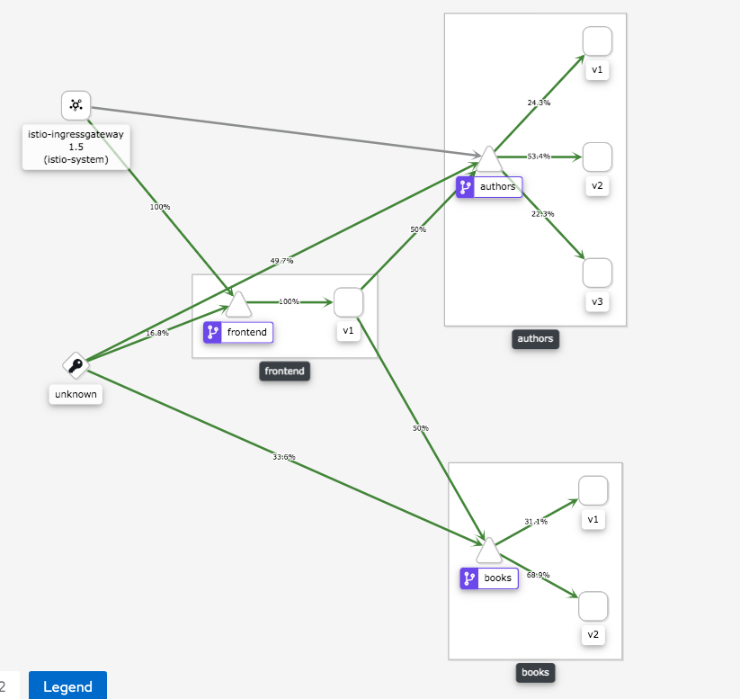

# Istio Virtual Service

Here I deployed three versions for `authors` services and two versions for `books` services. 
## Authors:
`Authors` deployment has v1, v2, and v3 labels. v1 and v2 use `VirtualService` with a weight destination. For v1 I set 10%, for v2 I set 90%. Also, If you want to send a request to deployment v3 you should use header `x-developer illia-korotia`. For balancing traffic between these nodes uses `RANDOM` balancer.

## Books:
`Books` deployment has v1 and v2 labels. For v1 I set 10%, for v2 I set 90%. For balancing traffic between these nodes uses `ROUND_ROBIN` balancer.

## Traffic percentage:


## Responses:
1. Response from `authors:v2` and `books:v2`
```bash
ikorotia$ curl --location --request GET 'http://10.98.86.25/frontend-catalog/api/v1/dashboard' | python -m json.tool
  % Total    % Received % Xferd  Average Speed   Time    Time     Time  Current
                                 Dload  Upload   Total   Spent    Left  Speed
100   606    0   606    0     0  28402      0 --:--:-- --:--:-- --:--:-- 28857
{
    "authors": [
        {
            "age": 30, // new field
            "firstName": "Loreth Anne",
            "id": 1,
            "lastName": "White"
        },
        {
            "age": 20, // new field
            "firstName": "Lisa",
            "id": 2,
            "lastName": "Regan"
        },
        {
            "age": 55, // new field
            "firstName": "Ty",
            "id": 3,
            "lastName": "Patterson"
        }
    ],
    "books": [
        {
            "authorId": 1,
            "id": 1,
            "pages": 326,
            "publishedYear": 1990, // new field
            "title": "Semiosis: A Novel"
...
```
2. Response from `authors:v1` and `books:v2`
```bash
ikorotia$ curl --location --request GET 'http://10.98.86.25/frontend-catalog/api/v1/dashboard' | python -m json.tool
  % Total    % Received % Xferd  Average Speed   Time    Time     Time  Current
                                 Dload  Upload   Total   Spent    Left  Speed
100   606    0   606    0     0  28402      0 --:--:-- --:--:-- --:--:-- 28857
{
    "authors": [
        {
            "firstName": "Loreth Anne",
            "id": 1,
            "lastName": "White"
        },
        {
            "firstName": "Lisa",
            "id": 2,
            "lastName": "Regan"
        },
        {
            "firstName": "Ty",
            "id": 3,
            "lastName": "Patterson"
        }
    ],
    "books": [
        {
            "authorId": 1,
            "id": 1,
            "pages": 326,
            "publishedYear": 1990, // new field
            "title": "Semiosis: A Novel"
        },
...
```
3. Response from `authros:v2` and `books:v1`
```bash
ikorotia$ curl --location --request GET 'http://10.98.86.25/frontend-catalog/api/v1/dashboard' | python -m json.tool
  % Total    % Received % Xferd  Average Speed   Time    Time     Time  Current
                                 Dload  Upload   Total   Spent    Left  Speed
100   606    0   606    0     0  28402      0 --:--:-- --:--:-- --:--:-- 28857
{
    "authors": [
        {
            "age": 30, // new filed
            "firstName": "Loreth Anne",
            "id": 1,
            "lastName": "White"
        },
        {
            "age": 20, // new filed
            "firstName": "Lisa",
            "id": 2,
            "lastName": "Regan"
        },
        {
            "age": 55, // new filed
            "firstName": "Ty",
            "id": 3,
            "lastName": "Patterson"
        }
    ],
    "books": [
        {
            "authorId": 1,
            "id": 1,
            "pages": 326,
            "title": "Semiosis: A Novel"
        },
...
```
